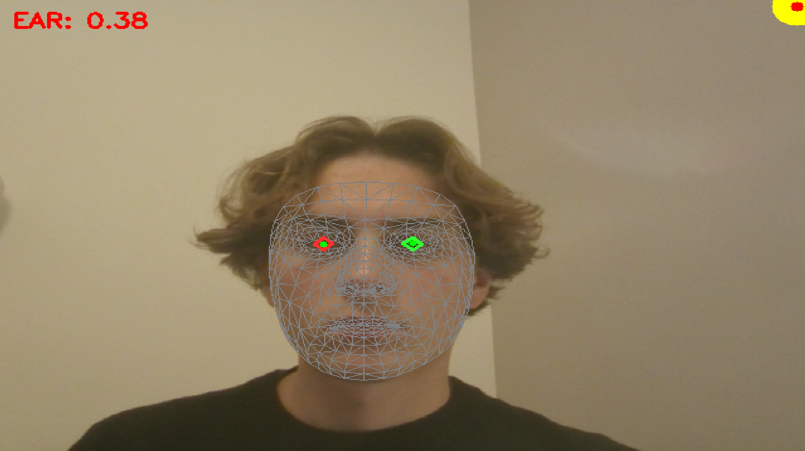

# Eye-Cursor

**Control your mouse with your eyes.**

Eye-Cursor is a contactless human-computer interaction (HCI) system that allows users to control the mouse cursor through eye movements and trigger clicks using blink gestures. Developed with Python, OpenCV, and MediaPipe, this software transforms a standard built-in PC camera into an intelligent input device. It requires no external hardware, infrared sensors, or expensive equipment, making intuitive, hands-free navigation accessible to anyone with a simple webcam.



## ✨ Features

- **Real-time Eye Tracking**: Uses MediaPipe Face Mesh for precise iris tracking.
- **Blink-to-Click**: Rapidly blink (or wink) to trigger a mouse click.
- **9-Point Calibration**: robust calibration system to map your eye gaze to your screen dimensions.
- **Motion Smoothing**: Integrated smoothing algorithms to reduce jitter and provide a smoother cursor experience.
- **Privacy First**: All processing is done locally on your machine. No video data is stored or sent to the cloud.

## 🛠️ Installation

1.  **Clone the repository:**
    ```bash
    git clone https://github.com/yourusername/eyetracking.git
    cd eyetracking
    ```

2.  **Install dependencies:**
    It is recommended to use a virtual environment.
    ```bash
    pip install -r requirements.txt
    ```

##  Usage

1.  **Run the application:**
    ```bash
    python main.py
    ```

2.  **Calibration:**
    - The application will launch in fullscreen mode.
    - Look at the yellow/red target dots that appear on the screen.
    - For each dot, look directly at it and press **SPACE** or **CLICK** your physical mouse to capture the calibration point.
    - There are 9 points in total.

3.  **Control:**
    - Once calibration is complete, the window will close.
    - **Move**: Look around the screen to move the mouse cursor.
    - **Click**: Perform a distinct blink/wink to click.

4.  **Recalibrate / Exit:**
    - To **Recalibrate**: Press **'c'** (if the window is in focus) or restart the application.
    - To **Exit**: Press **ESC** key in the terminal or interrupt the process (Ctrl+C).

## ⚙️ Configuration & Troubleshooting

- **Lighting**: Ensure your face is well-lit. Avoid strong backlighting.
- **Camera Position**: Position your webcam at eye level for best results.
- **Sensitivity**: You can adjust `ear_threshold` in `blink_detector.py` if clicks are too sensitive or hard to trigger.
- **Smoothing**: Adjust `buffer_size` in `gaze_tracker.py` to change the responsiveness vs. smoothness trade-off.

## 📦 Dependencies

- `opencv-python`: Video capture and image processing.
- `mediapipe`: Facial landmark detection.
- `pyautogui`: Mouse control.
- `numpy`: Numerical operations.

## 📝 License

This project is open-source. Feel free to use and modify it.
